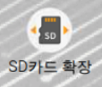
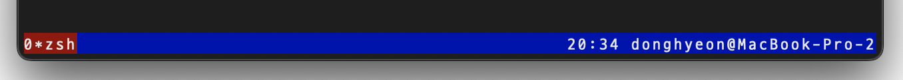

# Jenga_GPT_KOR

---

1. 시작하기 전에…
    1. 이 글은 2023년 6월에 작성된 글로 차후 API 변경 등의 외부 요소의 변경이 있을 경우 작동하지 않을 수 있다.
    2. 이 글에 대한 문의사항이 있거나, 진행하면서 생기는 문제에 대해 문의사항이 있으시면 레포지토리의 Issue를 통해 문의 바랍니다.
2. 대화형 AI 인형 Ichigo의 기본 개요
    1. 라즈베리파이4B, AI MAKERS KIT, OpenAI를 활용해 만든 대화형 AI 인형.
    2. 아이들이 사용하는 애착 인형에 대화 하는 기능 추가해 아이의 정서 안정의 기여를 목표로 한다.
    3. 유튜브 API를 활용한 음악 재생, TTS 엔진을 활용한 동화책 읽어주기 기능으로 부모님의 육아 피로를 덜어주는 것을 목표로 한다.
3. 하드웨어 준비하기
    1. 필수 하드웨어
        - 라즈베리파이 4B Rev 1.2~1.4, Rev 1.5
        - 라즈베리파이 전용 방열판
            - 방열판을 사용하지 않을 경우 인형 내부에 넣었을 때 고온으로 인한 쓰로틀링 및 전원 꺼짐 가능성 있음.
            - (Option) 인형 내부의 충분한 공간을 가지는 경우 쿨링팬 사용도 고려해볼 수 있다.
        - A1 수준의 속도를 가지는 microSD카드
        - AI MAKERS KIT KT 기가지니 인공지능 교육키트
            - 아래의 링크에서 구매 할 수 있다.
            - [https://mechasolution.com/shop/goods/goods_view.php?goodsno=582424&category=](https://mechasolution.com/shop/goods/goods_view.php?goodsno=582424&category=)
        - 라즈베리파이 배터리 전원 확장보드
            - Jenga에서 사용했던 확장보드는 아래의 제품을 사용함
            - [https://www.devicemart.co.kr/goods/view?no=1383800](https://www.devicemart.co.kr/goods/view?no=1383800)
            - 위 링크의 제품 같이 보호회로가 포함 되어 있는 확장보드를 사용 할 경우 18650 비보호 배터리가 필요함. (국내에서는 개인의 비보호 배터리 구매가 어려우므로 보호회로가 붙어 있는 배터리를 구매 후 보호 회로를 제거 후 사용하여야 함.)
            - 18650 배터리를 사용 할 경우 가품 구매를 주의해야 하며 검증 된 쇼핑몰에서 안정성이 검증된 배터리 구매를 권장한다. (삼성, LG, 파나소닉)
            - 위 제품 이외의 다양한 배터리 확장 제품이 있으므로 사용 할 인형 크기에 따라 다른 제품도 확인해보는 것을 권장한다.
        - 하드웨어를 넣을 공간이 충분한 인형
4. 하드웨어 기초 셋팅
    1. 라즈베리파이 운영체제 설치
        - [https://aicodiny.com/download](https://aicodiny.com/download) 에 접속해 자신의 라즈베리파이에 맞는 운영체제 이미지를 다운로드 한다.
        - PC에서 balenaEtcher를 이용해 microSD카드에 운영체제를 설치한다.
        - 설치 완료 후 라즈베리파이에 microSD카드를 삽입한다.
    2. AI 코디니 킷 조립
        - 인형의 사이즈를 고려해 조립 여부를 결정한다.
            - 아크릴 케이스가 들어 갈 수 없을만큼 인형의 사이즈가 작다면 케이스를 제외하고 통합 보드만 결합하는 것을 고려할 수 있다.
        - 아래 링크를 참고하며 조립을 진행한다
            - [https://youtu.be/cpl3jVHz8t4](https://youtu.be/cpl3jVHz8t4)
        - 아크릴 케이스에 배터리 확장 보드 장착
            - 코디니 킷의 아크릴 케이스는 배터리 장착 가이드 / 홀이 없으므로 사용하는 배터리 확장보드에 따라 원하는 대로 장착하면 된다.
5. 운영체제 및 소프트웨어 기본 설정
    - **Warning) AI 코디니에서 제공하는 운영체제는 Raspbian Buster를 AI 코디니에서 수정을 가한 운영체제이므로 apt를 통해  패키지 업그레이드를 할 경우 AI 코디니에서 수정해 두었던 기본 설정이 꼬일 가능성이 있으므로 apt를 통해 패키지 업그레이드를 권장하지 않으며 AI코디니에서 제공하는 업데이트만 받는 다는 전제하에 설명한다.**
    - **Warning) 파이썬 버전은 3.7 버전을 사용하며 이외의 버전에서 정상 작동을 보장하지 않는다.**
    - **Warning) 다른 GPIO 확장 킷(터치 디스플레이 등)을 사용함으로써 생기는 문제는 사용자가 직접 해결해야 한다.**
    - **Warning) AI 코디니에서 제공하는 운영체제의 사용자 ID는 pi, 초기 비밀번호는 kt123!@#이다.**
        - **ssh를 사용 할 예정이라면 비밀번호 변경을 권장한다.**
    - 시스템 초기화 및 업데이트 진행
        - 첫 부팅 후 바탕화면의 “시스템 초기화” 아이콘을 더블클릭해 시스템 초기화를 진행한다.
        - 초기화 후 바탕화면의 “AI코딩팩 업데이트” 아이콘을 더블클릭해 업데이트를 진행한다.
    - SD카드 확장하기
        - 16기가 이상의 microSD를 사용 중이라면  microSD 카드의 모든 용량을 사용하기 위해서 확장 작업이 필요하다.
            
            
            
        - 바탕화면의 “SD카드 확장” 아이콘을 더블 클릭하면 아래의 작업을 할 필요가 없지만 에러가 발생할 경우 직접 아래의 수동 작업을 해줘야 한다.
        - SD카드 수동 확장 방법
            - 터미널을 열어서 아래의 명령어를 입력한다.
                
                ```bash
                sudo raspi-config
                ```
                
            - 7 Advanced Options를 선택 → A1 Expand Filesystem 선택 → Would you like to reboot now? 라는 창이 뜨면 Yes 선택
    - **아래 과정 부터는 네트워크 연결이 필요하다.**
    - 절전모드 끄기
        - xscreensaver 설치
            
            ```bash
            sudo apt install xscreensaver
            ```
            
            - 설치 후 좌측 상단 라즈베리 아이콘 → 설정 → Screensaver 선택
            - Mode → Disable Screen Saver 설정
    - ssh 개방 (Option)
        - 라즈베리파이에 직접 HDMI를 연결하여 설정 할 경우 필수는 아니나, 인형에 넣은 상태에서 유지보수를 하려고 한다면 설정하는 것이 좋다.
        - 내부망에서만 사용하는 것을 상정하여 설명하는 것 이기에 외부 접속을 위한 포트 개방 등의 설정은 설명하지 않는다.
        - 터미널을 열어서 아래의 명령어를 입력한다.
            
            ```bash
            sudo raspi-config
            ```
            
        - 5 Interfacing Options 선택 → P2 SSH 선택 → Would you like the SSH server to be enabled? 라는 창이 뜨면 Yes 선택.
        - 터미널 창에서 ifconfig를 입력하여 wlan0의 IP주소를 확인한다.
            - 연결 환경에 따라 다를 수도 있다. ex) RJ45 랜선을 통해 인터넷에 연결한 경우 eth0의 IP 주소를 확인해야 한다.
            - 아래 예시 참고
                
                ```bash
                pi@pi:~ $ ifconfig
                eth0: # ~ 생략 ~
                lo: # ~ 생략 ~
                wlan0: # ~ 생략 ~
                			 inet 192.168.0.29 ##<<-- 이 IP 주소를 확인해야 한다.
                ```
                
        - 윈도우에서 ssh를 통해 라즈베리파이 터미널 접속하기
            - [Putty](https://www.putty.org)를 사용한다.
        - Mac, Linux에서 ssh를 통해 라즈베리파이 터미널 접속하기
            - 아래의 예시 참고
                
                ```bash
                # ssh username@ip.add.re.ss -p port_number
                
                kjr@byungshin$ ssh pi@192.168.0.29 -p 6974
                pi@192.168.0.29 's password: 
                # ~ 생략 ~
                pi@pi:~$
                ```
                
    - Github에서 Jenga_GPT 레포지토리 받기
        - 홈 폴더에서 아래 명령어를 입력한다.
            
            ```bash
            $ git clone https://github.com/YJU-Jenga/Jenga_GPT_KOR.git && cd Jenga_GPT_KOR
            ```
            
    - Jenga_GPT 기본 설정하기
        - Jenga_GPT 폴더에서 아래 명령어를 입력한다.
            
            ```bash
            nano config.py
            ```
            
    - [config.py](http://config.py)에 다음과 같은 코드를 작성한다.
        
        ```bash
        openai_api_key = "openai_api_key"
        youtube_api_key = "youtube_api_key"
        database_password = "database_password"
        
        db_config = {
            'host': 'localhost',
            'user': 'jenga',
            'password': 'database_password',
            'database': 'jenga',
            'charset': 'utf8',
        }
        ```
        
        - openai_api_key와 youtube_api_key 부분에 사용자가 만든 api키를 삽입해야 한다.
        - api 발급 방법은 아래의 방법을 따른다.
            - openai_api_key 발급 가이드
                
                OpenAI API 키 발급을 위한 절차는 아래와 같다.
                
                1. OpenAI 웹사이트 방문: OpenAI의 공식 웹사이트(**[https://openai.com)에](https://openai.xn--com%29-uw20a/)** 접속한다.
                2. API 페이지 찾기: 웹사이트에서 "API" 또는 "OpenAI API"와 관련된 페이지 또는 섹션을 찾는다. 이 페이지에는 API 키 발급 및 사용에 대한 정보가 포함되어 있다.
                3. API 키 요청: API 페이지에서 API 키를 요청하기 위해 "Get started" 또는 "Sign up"과 같은 버튼을 클릭하거나, 해당 페이지의 지침을 따른다.
                4. 가입/로그인: OpenAI API 사용을 위해 OpenAI에 가입 또는 로그인해야 할 수 있다. 이미 OpenAI 계정이 있다면 해당 계정으로 로그인하고, 그렇지 않은 경우 새로운 계정을 생성한다.
                5. 신청서 작성: API 사용 신청서를 작성해야 사용 할 수 있다. 이 신청서에서는 API 사용 목적이나 예상 사용량 등에 대한 정보를 작성해야 한다. 필요한 정보를 정확하게 작성하고 제출한다.
                6. API 키 발급: OpenAI는 신청서를 검토하고 승인한 후, API 키를 발급해준다. 이 키는 개인적인 인증 정보이므로 안전하게 보관해야 한다.
                7. API 문서 및 가이드 확인: API 키를 발급받은 후, OpenAI의 API 문서와 가이드를 확인하여 API를 사용하는 방법과 기능에 대해 알아본다. OpenAI는 API 사용에 대한 자세한 가이드와 예제를 제공한다.
                
                **Option)** 위의 단계는 대략적인 가이드일 뿐이며, OpenAI의 정책이나 절차가 변경될 수 있으므로 실제 절차는 OpenAI 웹사이트에서 확인하는 것이 좋다.
                
                **Option)** OpenAI의 공식 문서와 지원 채널에서 API 사용에 대한 자세한 정보와 도움을 받을 수 있다.
                
            - youtube_api_key 발급 가이드
                
                YouTube API 키 발급을 위한 절차는 아래와 같다.
                
                1. Google Cloud Console 접속: Google Cloud Console(**[https://console.cloud.google.com)에](https://console.cloud.google.xn--com%29-uw20a/)** 접속한다.
                2. 프로젝트 생성: Google Cloud Console에 로그인한 후, 새 프로젝트를 생성한다. 프로젝트 이름을 지정하고, 필요한 설정을 완료한다.
                3. API 및 서비스 활성화: 생성한 프로젝트를 선택하고, "API 및 서비스" 메뉴로 이동한다. 그 다음 메뉴에서 YouTube Data API를 검색하고, 해당 API를 활성화한다.
                4. 사용자 인증 정보 생성: "사용자 인증 정보" 메뉴로 이동하여 "사용자 인증 정보 만들기"를 선택한다. API 키를 선택하고, 필요한 설정을 완료한다.
                5. API 키 가져오기: API 키가 생성되면, 해당 키를 안전한 곳에 저장하거나 복사해둔다. 이 API 키를 사용하여 YouTube API에 접근하고 요청을 보낼 수 있다.
                    
                    **Option)** 위의 절차는 YouTube API 키를 발급받는 대략적인 가이드이며, Google의 정책에 따라 절차 및 사용 방법이 변경될 수 있다. 
                    
                    **Option)** 실제 절차는 Google Cloud Console에서 확인하는 것이 좋다. 
                    
                    **Option)** Google Cloud Console의 문서와 지원 채널은 API 키 발급과 관련된 자세한 정보와 도움을 제공하므로 필요시 참고하는 것이 좋다.
                    
    - screen을 활용해 Jenga_GPT 백그라운드에서 실행 할 준비하기
        1. SSH로 라즈베리 파이에 접속한다.
        2. 터미널에서 다음 명령어를 사용하여 Screen을 설치한다.
            
            ```bash
            sudo apt-get install screen
            ```
            
        3. screen 사용 전 기본 설정을 한다.
            
            ```bash
            $ nano ~/.screenrc
            ```
            
            1. nano를 통해 ~/.screenrc 파일에 아래의 스크립트를 붙여넣는다.
            
            ```bash
            defscrollback 5000
            termcapinfo xterm* ti@:te@
            startup_message off
            hardstatus on
            hardstatus alwayslastline
            hardstatus string "%{.bW}%-w%{.rW}%n*%t%{-}%+w %= %c ${USER}@%H"
            bindkey -k k1 select 0
            bindkey -k k2 select 1
            bindkey -k k3 select 2
            ```
            
            1. 붙여넣기를 완료하였으면 `**Ctrl + x**` → **`y`** → **`Enter`** 통해 파일을 저장한다.
        4. 스크린 세션을 시작한다.
            
            ```bash
            $ screen -S Jenga_GPT
            ```
            
        5. 이제 스크린 세션 내에서 원하는 작업을 실행할 수 있다. 위의 ~/.screenrc 파일에 스크립트를 추가하는 작업을 했다면 아래 사진 처럼 터미널 하단에 파란색 바가 생겨서 screen에 진입하였음을 확인 할 수 있다.
            
            
            
        6. screen 세션에 진입한 것이 확인되면 Jenga_GPT 폴더에서 아래의 명령어를 실행한다.
        
        ```bash
        $ python3 jwt_token.py
        ```
        
        1. screen 세션을 백그라운드로 전환하려면 **`Ctrl + A + D`** 를 순서대로 누르면 screen 세션은 백그라운드로 전환된다.
        2. screen 세션을 다시 가져오려면 아래와 같은 명령어를 사용한다.
            
            ```bash
            $ screen -ls #<- 실행중인 세션을 출력한다.
            $ screen -r Jenga_GPT #<- Jenga_GPT 세션으로 진입한다.
            ```
            
        3. 스크린 세션을 완전히 종료하려면 세션 내에서 아래의 명령어를 입력한다.
            
            ```bash
            exit
            ```
            
    - 위의 과정을 통해 만든 screen 세선에서 main 파일 실행하여 Jenga_GPT를 실행한다.
        
        ```bash
        $ python3 GPT_Kinou2.py
        ```
        
6. 인형에 넣기
- 라즈베리 파이와 배터리를 인형 내부에 넣기 위해서는 발열 관리와 쇼트가 나지 않도록 배선 작업에 유의해야 한다. 아래는 각 작업에 대한 고려사항이다.
    1. 쓰로틀링을 막기 위한 발열 관리:
        - 인형 내부에 라즈베리 파이를 넣을 경우, 열이 발생할 수 있으므로 적절한 쿨링 시스템을 구성해야 한다. 이를 위해 작은 쿨링팬이나 SoC와 RAM에 히트싱크를 사용할 수 있다.
        - 쿨링팬을 사용하는 경우, 인형의 내부 구조를 고려하여 팬을 배치하고, 열이 효율적으로 배출될 수 있도록 쿨링팬의 풍압과 공기 흐름을 고려해야 한다.
    2. 배선 작업:
        - 라즈베리파이와 연결된 스피커, 마이크를 인형 내부에서 안정적으로 작동 할 수 있도록 적절한 배선 작업이 필요하다.
        - 내부 케이블이 끊어서 합선이나 화재가 나지 않도록 배선 작업을 해야한다.
- 위의 작업은 전기적 안전 및 발열 관리를 위한 주기적인 점검과 주의가 필요하다.
